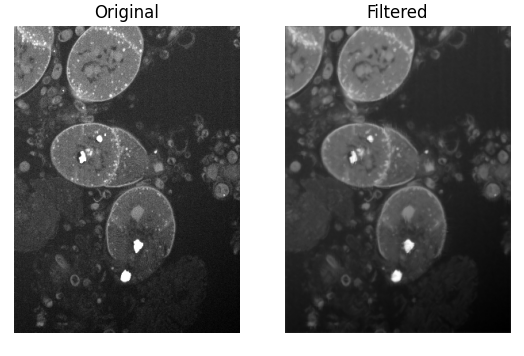
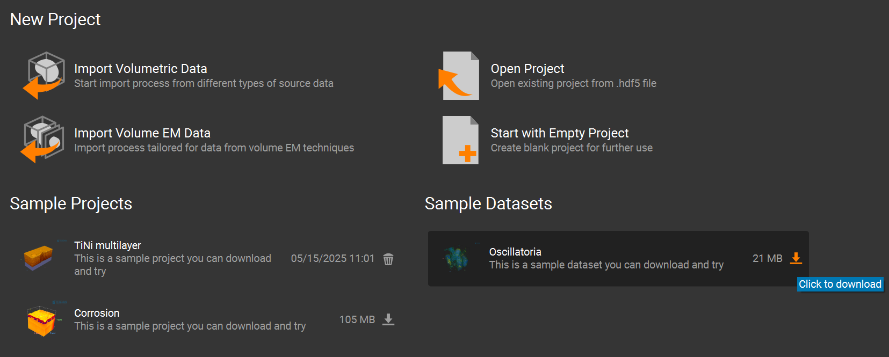
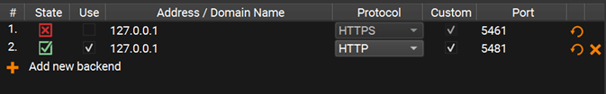
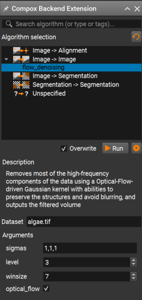

# FlowDenoising Deployment
This tutorial shows how to prepare and deploy an algorithm to **Compox** and run it in **Tescan 3D Viewer** (and optionally **Tescan Picannto**). We’ll use the **FlowDenoising** algorithm from [GitHub](https://github.com/ElsevierSoftwareX/SOFTX-D-23-00180?tab=readme-ov-file) as an example. The **FlowDenoising** algorithm suppresses high-frequency noise using an **optical-flow-driven Gaussian kernel**. The **FlowDenoising** source code is distributed under the terms of the [GNU General Public License v3.0 (GPL-3.0)](https://www.gnu.org/licenses/gpl-3.0.html).

> **V. González-Ruiz, M.R. Fernández-Fernández, J.J. Fernández.**  
> *Structure-preserving Gaussian denoising of FIB-SEM volumes.*  
> *Ultramicroscopy* **246**, 113674 (2023).  
> DOI: [10.1016/j.ultramic.2022.113674](https://doi.org/10.1016/j.ultramic.2022.113674)



## 1. Compox Installation

For managing dependencies, we recommend using **`uv`** — it's fast and automatically handles both your environment and package versions. You can install it by this command:

```bash
pip install uv
```

You can set up your project and environment by running this command in your project’s root directory:

```bash
uv init
```

Next, activate the project virtual environment:

```bash
.\.venv\Scripts\Activate.ps1
```

Once the environment is ready, install **Compox** using:

```bash
uv add compox
```

Generate a server config:

```bash
compox generate-config --path app_server.yaml
```

Config `app_server.yaml` should appear in project’s root directory. Now create an empty folder called **`algorithms`** in your project’s root directory. You now have everything ready to start creating algorithms.

```plaintext
project_root/
├── algorithms/
└── app_server.yaml
```

## 2. Importing **FlowDenoising** as submodule ##
Create an algorithm root directory inside **`algorithms`** directory. We’ll call it flow_denoising:

From within this new directory, you can download the algorithm’s source code from GitHub into a subfolder named **`files`** by running:

```bash
git submodule add https://github.com/ElsevierSoftwareX/SOFTX-D-23-00180.git files
```

After importing the submodule, your project structure should look like this:

```plaintext
project_root/
├── algorithms/
│   └── flow_denoising/
│       └── files/
│           ├── manual/...
│           ├── src/...
│           └── LICENCE.txt
└── app_server.yaml
```

The repository includes a `requirements.txt` at `algorithms/flow_denoising/files/src/requirements.txt`. Install the dependencies:

```bash
uv add --requirements algorithms/flow_denoising/files/src/requirements.txt
```

## 3. Creating the `pyproject.toml` file

The **`pyproject.toml`** file contains metadata and configuration for your algorithm. It is used by **Compox** during the deployment process to register the algorithm as a service. Place it in the **`flow_denoising`** directory:

```plaintext
project_root/
├── algorithms/
│   └── flow_denoising/
│       ├── files/
│       │   ├── manual/...
│       │   ├── src/...
│       │   └── LICENCE.txt
│       └── pyproject.toml
└── app_server.yaml
```

### [project] section – basic package information ###

This section defines general information about your algorithm. At minimum, you must include the **name** and **version** fields. The version follows the major.minor.patch format (e.g. 0.1.0).

```toml
[project]
name = "flow_denoising"
version = "0.1.0"
```

### [tool.compox] section – Algorithm-specific configuration ###

This section contains settings used by **Compox** itself — how your algorithm behaves, what devices it supports, and which parameters users can configure. Although all fields here are optional, it’s recommended to include them for better integration and usability.

```toml
[tool.compox]
algorithm_type = "Image2Image"
tags = ["image-denoising", "Image2Image"]
description = "Removes most of the high-frequency components of the data using a Optical-Flow-driven Gaussian kernel with abilities to preserve the structures and avoid blurring, and outputs the filtered volume"
supported_devices = ["cpu", "gpu"]
default_device = "cpu"
additional_parameters = [
    {name = "sigmas", description = "Standard deviations of the Gaussian kernel in each dimension.", config = {type = "int_list", default = [1, 1, 1], adjustable = true}},
    {name = "level", description = "Level parameter for optical flow filtering.", config = {type = "int", default = 3, adjustable = true}},
    {name = "winsize", description = "Window size parameter for optical flow filtering.", config = {type = "int", default = 7, adjustable = true}},
    {name = "optical_flow", description = "Enable or disable optical flow filtering.", config = {type = "bool", default = true, adjustable = true}},]

check_importable = false
obfuscate = true
hash_module = true
hash_assets = true
```

#### Explanation of key fields: ####

For a detailed explanation of all `[tool.compox]` fields, see the
[How to create an algorithm module](../README.md#the-pyprojecttoml-file).


## 4. Creating `Runner.py` ##

`Runner.py` is the entry point **Compox** calls to execute your algorithm. Place it in `algorithms/flow_denoising`:

```plaintext
project_root/
├── algorithms/
│   └── flow_denoising/
│       ├── files/
│       │   ├── manual/...
│       │   ├── src/...
│       │   └── LICENCE.txt
│       ├── pyproject.toml
│       └──Runner.py
└── app_server.yaml
```

### Importing dependencies ###
For this example, we’ll use **NumPy** for numerical operations. Make sure it is installed in your environment (if not, you can add it with):

```bash
uv add numpy
```

Since this algorithm is of type **Image2Image**, we will inherit from **Image2ImageRunner**, which can be imported from `compox.algorithm_utils.Image2ImageRunner`.

For debugging, we can also import the helper function **debug** from `compox.algorithm_debug`.

From the **FlowDenoising** source code (in the submodule `files/src/flowdenoising_sequential`), we will use three main functions:

* **get_gaussian_kernel**
* **OF_filter**
* **no_OF_filter**

Here’s the complete set of imports:

```python
import numpy as np

from files.src.flowdenoising_sequential import get_gaussian_kernel, OF_filter, no_OF_filter
from compox.algorithm_utils.Image2ImageRunner import Image2ImageRunner
from compox.algorithm_debug import debug
```

### Initializing the `Runner` class ###
As mentioned earlier, the `Runner` class should inherit from **Image2ImageRunner**. This base class already handles data fetching, preprocessing, and uploading the results back. For this algorithm, you only need to override the `inference` method. It receives the input data as an **np.ndarray** together with a **dict** of parameters, and must return the processed data as an **np.ndarray**. If you want to customize how data is fetched or uploaded, you can override these methods yourself or inherit directly from **BaseRunner**. For more details, see [How to create an algorithm module](../README.md#the-runnerpy-file).

 A minimal skeleton looks like this:

```python
class Runner(Image2ImageRunner):

    def inference(self, input_data: np.ndarray, args: dict = {}) -> np.ndarray:
        pass
```

### Implementing FlowDenoising in the `inference` method ###
First, extract all user-defined parameters from the input dictionary `args`:

```python
# Extract parameters
sigmas = args["sigmas"]
l = args["level"] 
w =  args["winsize"]
optical_flow = args["optical_flow"]
```

Next, compute Gaussian kernels for each dimension:

```python
# Create Gaussian kernels for each dimension
k_x = get_gaussian_kernel(int(sigmas[0]))
k_y = get_gaussian_kernel(int(sigmas[1]))
k_z = get_gaussian_kernel(int(sigmas[2]))
kernel = [k_x, k_y, k_z]
```

Depending on the boolean value of `optical_flow`, apply the appropriate FlowDenoising function to the input data:

```python
# Apply filtering
if optical_flow == True:
    filtered_vol = OF_filter(input_data, kernel, l, w)
else:
    filtered_vol = no_OF_filter(input_data, kernel)
```

Finally, ensure the output is of type `float32` and normalized to the range `[0, 1]`:

```python
# Ensure output data is float32
out_data = filtered_vol.astype(np.float32).copy()

# Normalize output data to [0, 1]
vmin = float(np.nanmin(out_data))
vmax = float(np.nanmax(out_data))
if vmax > vmin:
    out_data = (out_data - vmin) / (vmax - vmin)
else:
    out_data[:] = 0.0

return out_data
```
Full example: `Runner.py`

```python
import numpy as np

from files.src.flowdenoising_sequential import get_gaussian_kernel, OF_filter, no_OF_filter
from compox.algorithm_utils.Image2ImageRunner import Image2ImageRunner
from compox.algorithm_debug import debug

class Runner(Image2ImageRunner):

    def inference(self, input_data: np.ndarray, args: dict = {}) -> np.ndarray:

        # Extract parameters
        sigmas = args["sigmas"]
        l = args["level"] 
        w =  args["winsize"]
        optical_flow = args["optical_flow"]

        # Create Gaussian kernels for each dimension
        k_x = get_gaussian_kernel(int(sigmas[0]))
        k_y = get_gaussian_kernel(int(sigmas[1]))
        k_z = get_gaussian_kernel(int(sigmas[2]))
        kernel = [k_x, k_y, k_z]

        # Apply filtering
        if optical_flow == True:
            filtered_vol = OF_filter(input_data, kernel, l, w)
        else:
            filtered_vol = no_OF_filter(input_data, kernel)

        # Ensure output data is float32
        out_data = filtered_vol.astype(np.float32).copy()

        # Normalize output data to [0, 1]
        vmin = float(np.nanmin(out_data))
        vmax = float(np.nanmax(out_data))
        if vmax > vmin:
            out_data = (out_data - vmin) / (vmax - vmin)
        else:
            out_data[:] = 0.0

        return out_data
```

## 5. Debugging `Runner.py`
Once your first implementation is ready, you will likely want to run it on a small data sample with debugging support to verify its behavior. The `compox.algorithm_debug.debug` function allows you to test your algorithm **without launching Tescan 3D Viewer**. It does not load data the same way as the Viewer — the debug tool simply reads the input files directly from disk. However, the rest of the execution pipeline behaves the same: the data is stored in the database, then the `preprocess`, `inference`, and `postprocess` steps run in the same order, and the results are uploaded back to the database. If everything completes successfully, you should see an output similar to this:

```plaintext
2025-11-27 15:04:58.393 | INFO     | compox.algorithm_utils.BaseRunner:run:244 - Starting execution.
2025-11-27 15:04:58.395 | INFO     | compox.algorithm_utils.BaseRunner:preprocess_base:287 - Data preprocessing finished in 0.0 seconds
2025-11-27 15:04:58.395 | INFO     | compox.algorithm_utils.BaseRunner:inference_base:336 - Running inference.
2025-11-27 15:05:00.192 | INFO     | compox.algorithm_utils.BaseRunner:inference_base:339 - Inference finished in 1.8 seconds
2025-11-27 15:05:00.192 | INFO     | compox.algorithm_utils.BaseRunner:postprocess_base:386 - Postprocessing output data.
2025-11-27 15:05:00.192 | INFO     | compox.tasks.TaskHandler:post_data:904 - Uploading 6 results to the database.
2025-11-27 15:05:00.192 | INFO     | compox.algorithm_utils.BaseRunner:postprocess_base:389 - Postprocessing finished in 0.0 seconds
2025-11-27 15:05:00.192 | INFO     | compox.algorithm_utils.BaseRunner:run:253 - Execution completed in 1.8 seconds.
2025-11-27 15:05:00.192 | INFO     | compox.tasks.TaskHandler:_log_file_stats:402 - File fetching stats: 6.0 files fetched in 0.0010 seconds.
2025-11-27 15:05:00.192 | INFO     | compox.tasks.TaskHandler:_log_file_stats:406 - File posting stats: 6.0 files posted in 0.0000 seconds.
```

### Debug function inputs ###
The debug function accepts four inputs:

- **data** – path to a dataset on your local disk. This can be either path to folder containing image slices (**.jpg**, **.png**, **.tiff**), or a 3D volume (**.tiff**, **.npy**, **.hdf5**).

- **algo** – path to the root directory of your algorithm.

- **params** – a dictionary containing additional algorithm parameters.

- **device** – compute device to run the algorithm on (e.g., `"cpu"` or `"gpu"`).

You can use your own data, or you can use one of the sample datasets included in **Tescan 3D Viewer**.  
For example, the **Oscillatoria** dataset can be downloaded from the **Welcome Page** of the Viewer.



Its default location is: 

```plaintext
`...\User\Documents\TESCAN GROUP, a.s.\Tescan 3D Viewer\Sample projects and datasets\Oscillatoria_dataset\Oscillatoria3D.tif`. 
```
You can also import any dataset into the Viewer, crop it, export it, and then use that exported data for debugging.


### Running debug tool ###

You have two main options for debugging:
* Running your script in debug mode with `compox.algorithm_debug.debug()`
* Debug through the CLI

#### Option 1: Use the `debug()` Function ####
Add this code block at the bottom of your **`Runner.py`** and run it in your IDE (e.g. VS Code, PyCharm). When running `Runner.py` directly. 

```python
if __name__ == "__main__":
    debug(
        algo_dir="algorithms/flow_denoising",
        data="path to data",
        params={"sigmas": [1, 1, 1], "level": 3, "winsize": 7, "optical_flow": True},
        device="cpu",
    )
```

You can also use Python’s built-in debugger — simply insert a `breakpoint()` wherever you want to pause execution and run script manually:

```bash
uv run .\algorithms\flow_denoising\Runner.py
```

#### Option 2: Debug through the CLI ####
Just insert `breakpoint()` wherever you want to pause execution. Then run your algorithm from the terminal like this:

```bash
compox debug run --data "path to data" --algo "path to Flowdenoising algorithm" --device "cpu" --param sigmas=[1,1,1] --param level=3 --param winsize=7  --param optical_flow=true
```

### Visualization of filtered data ###
If you want to visually compare the original and filtered data during debugging, you can add a small helper method to your Runner class. For example:

```python
import matplotlib.pyplot as plt

def visualize(self, input_data, filtered_vol):
        plt.subplot(1, 2, 1)
        plt.imshow(input_data[input_data.shape[0] // 2, :, :], cmap='gray')
        plt.title("Original")
        plt.axis('off')

        plt.subplot(1, 2, 2)
        plt.imshow(filtered_vol[filtered_vol.shape[0] // 2, :, :], cmap='gray')
        plt.title("Filtered")
        plt.axis('off')

        plt.show()
```

To show this result only when debugging, we recommend using an environment variable. You can set it in the `__main__` block:

```python
import os

if __name__ == "__main__":
    os.environ["COMPOX_DEBUG_SHOW"] = "1"
    debug(
        algo_dir="algorithms/flow_denoising",
        data="path to data",
        params={"sigmas": [1, 1, 1], "level": 3, "winsize": 7, "optical_flow": True},
        device="cpu",
    )
```

Then, in your `inference` method, call the `visualize` function only when this environment variable is set:

```python
if os.getenv("COMPOX_DEBUG_SHOW") == "1":
    self.visualize(input_data, filtered_vol)
```

This way, the visualization will appear when you run `Runner.py` directly for debugging, but it will not show any extra windows when the algorithm is executed from **Tescan 3D Viewer**. After running, you should see a side-by-side comparison of the original and filtered slices:


## 6. Updating the progress bar in **Viewer** during inference ##
This step is optional. By default, the Viewer already displays a progress bar that is updated during most stages of the algorithm execution. However, during the `inference` step the progress bar is not updated and only continues once inference is fully completed.

### Simple progress updates inside `inference`

You can update the progress bar from anywhere inside the `inference` method using the `set_progress` function. The function accepts a floating-point value in the range **0.0 – 1.0**, representing the overall progress.

```python
# Extract parameters
sigmas = args["sigmas"]
l = args["level"] 
w =  args["winsize"]
optical_flow = args["optical_flow"]
self.set_progress(0.2)

# Create Gaussian kernels for each dimension
k_x = get_gaussian_kernel(int(sigmas[0]))
k_y = get_gaussian_kernel(int(sigmas[1]))
k_z = get_gaussian_kernel(int(sigmas[2]))
kernel = [k_x, k_y, k_z]
self.set_progress(0.3)

# Apply filtering
if optical_flow == True:
    filtered_vol = OF_filter(input_data, kernel, l, w)
else:
    filtered_vol = no_OF_filter(input_data, kernel)
self.set_progress(0.9)
```

The estimated remaining time is computed automatically by the Viewer based on how often and how smoothly the progress value is updated.

### More accurate progress updates using callbacks ###

In the FlowDenoising algorithm, most of the execution time is spent inside the `OF_filter` function. To obtain a more accurate progress estimation, the progress bar can be updated during the filtering itself, based on how much data has already been processed. This can be achieved by introducing a **progress callback** that is called repeatedly during processing.

#### Creating a progress callback helper ####

Add the following helper method to the `Runner` class:

```python
def make_progress_callback(self, start, end):
        span = end - start

        def callback(frac):
            frac_clamped = max(0.0, min(1.0, float(frac)))
            self.set_progress(start + span * frac_clamped)

        return callback
```

This helper creates a callback function that maps a fractional progress value `(0.0 – 1.0)` into a selected range of the global progress bar.

#### Passing the callback into `OF_filter` ####

Next, create a progress callback instance and pass it into OF_filter.
For simplicity, we map the entire inference step to the full progress range `0.0 – 1.0`:

```python
# Apply filtering
progress_callback = self.make_progress_callback(0.0, 1.0)
if optical_flow == True:
    filtered_vol = OF_filter(input_data, kernel, l, w, progress_callback)
else:
    filtered_vol = no_OF_filter(input_data, kernel)
```

#### Propagating progress through the filtering implementation ####

To enable progress reporting inside the filtering code, the original implementation of `OF_filter` must be extended to accept the callback and propagate it to all axis-specific filtering functions.

```python
def OF_filter(vol, kernel, l, w, progress_callback):
    mean = vol.mean()
    filtered_vol_Z = OF_filter_along_Z(vol, kernel[0], l, w, mean, axis_progress_callback=progress_callback)
    filtered_vol_ZY = OF_filter_along_Y(filtered_vol_Z, kernel[1], l, w, mean, axis_progress_callback=progress_callback)
    filtered_vol_ZYX = OF_filter_along_X(filtered_vol_ZY, kernel[2], l, w, mean, axis_progress_callback=progress_callback)

    return filtered_vol_ZYX
```

#### Reporting progress per axis ####

For progress reporting inside each axis loop, add the following helper function near the top of `flowdenoising_sequential.py`:

```python
def report_axis_progress(axis_progress_callback, axis, slice_idx, number_of_slices, axes = 3):
    if axis_progress_callback is None or number_of_slices <= 0:
        return
    base = axis / axes
    span = 1.0 / axes
    frac = (slice_idx + 1) / number_of_slices
    axis_progress_callback(base + span * frac)
```

For simplicity, this implementation assumes that processing time is evenly distributed across all axes.

#### Calling progress reporting inside axis filters ####

Finally, call `report_axis_progress` from inside each axis-specific filtering function. Example for filtering along the **Z** axis:

```python
def OF_filter_along_Z(vol, kernel, l, w, mean, axis_progress_callback=None):
    ...
    for z in range(Z_dim):
        ...
        report_axis_progress(axis_progress_callback, 0, z, Z_dim)

    return filtered_vol
```

For the remaining axes:
```python
report_axis_progress(axis_progress_callback, 1, y, Y_dim)
```

```python
report_axis_progress(axis_progress_callback, 2, x, X_dim)
```

This approach provides smooth and meaningful progress updates during inference, even for large volumetric datasets. A similar approach can also be applied to the `no_OF_filter` function if needed.

## 7. Algorithm Deployment ##
Once your algorithm is implemented and ready, you can deploy it to **Compox** using two options:
* **Single command**
* **GUI**

### Option 1: Deploy with single command ###
Simply run this command:

```bash
compox deploy-algorithms --config app_server.yaml
```

If you are running the server for the first time, the process might take a bit longer because **Compox** needs to download and initialize the **MinIO** service.

### Option 2: Deploy with GUI ###

As an alternative, you can use the built-in **Compox** GUI to manage algorithms more conveniently. First, edit your `app_server.yaml` file and enable GUI controls by setting the following values in the `gui` section:

```yaml
gui:
  algorithm_add_remove_in_menus: true
  use_systray: true
```

Then start the **Compox** server with:

```bash
compox run --config app_server.yaml
```

After running this command, you should see the **Compox** icon appear in the **system tray**:


Right-click the icon to open the context menu.
From there, you can:
* View all currently deployed algorithms
* Add a new algorithm by selecting its folder (in our case, choose `algorithms/flow_denoising`)

### Stopping the Server ###
* If you are using the GUI, right-click the tray icon and select **Quit** to stop the server. Using `Ctrl + C` in the terminal will not close the server properly when the GUI mode is active.
* If you are running from the terminal (without GUI), you can simply press `Ctrl + C`.

## 8. Running FlowDenoising in **`TESCAN 3D Viewer`** ##
After deploying the algorithm to **Compox**, you can run it directly on data loaded in **TESCAN 3D Viewer**.

### Step 1: Start the Compox server

Before launching `Tescan 3D Viewer`, make sure the **Compox** is running. Start the server with:

```bash
compox run --config app_server.yaml
```

### Step 2: Connect `Tescan 3D Viewer` to **Compox** ###

After starting the server, open `Tescan 3D Viewer`.
If you see an error saying that the Compox backend connection failed, don’t worry — you can fix this by adding a new backend manually:

1. Go to **Menu → Tools → Preferences**
2. Click **Add new backend**
3. Set the **Protocol** type to `HTTP`
4. Check the **Custom** checkbox
5. Set the **Port** number based on your `app_server.yaml` file
    * The default port is 5481
    * If you changed it, you can verify the value in the first line of `app_server.yaml`

Your **Preferences** window should now look like this:



### Step 3: Run the algorithm from the **Compox** extension

Once the backend is connected, import your dataset in `Tescan 3D Viewer`.

Then open the **Compox Backend Extension** by clicking the **Compox** icon in the upper-right corner of the interface.



In the **Compox Backend Extension** window you can:
* Select the algorithm you want to run
* Read its description
* Adjust parameters defined in your `pyproject.toml` file

After setting the parameters, click **Run** to start the inference. A progress bar should appear, and the algorithm will run on your dataset.