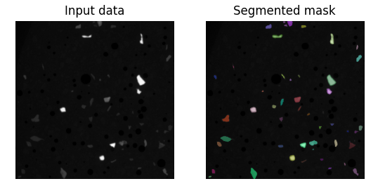
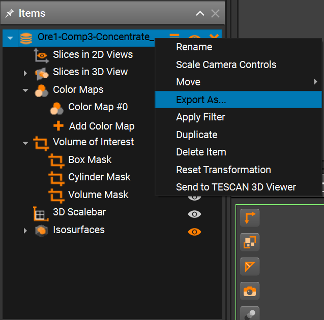
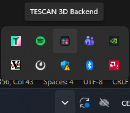
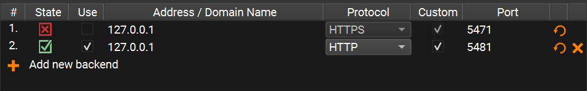
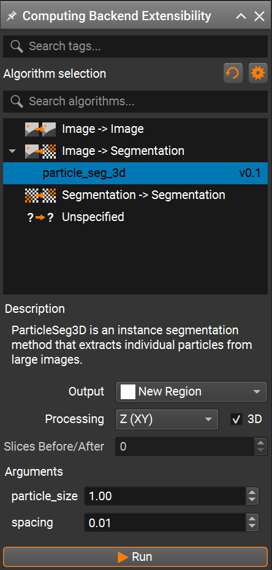

# ParticleSeg3D Deployment
This tutorial describes how to prepare and deploy an algorithm into **Compox** and run it in **TESCAN Picannto**. As an example, we use **ParticleSeg3D** algorithm from [GitHub](https://github.com/MIC-DKFZ/ParticleSeg3D?tab=readme-ov-file). The **ParticleSeg3D** is an instance segmentation method that extracts individual particles from large micro CT images based on `nnU-Net` framework. The source code is distributed under the terms of the [Apache  Software License 2.0](https://www.apache.org/licenses/LICENSE-2.0).
  
> Gotkowski, K., Gupta, S., Godinho, J. R. A., Tochtrop, C. G. S.,  
> Maier-Hein, K. H., & Isensee, F. (2024).  
> **ParticleSeg3D: A scalable out-of-the-box deep learning segmentation solution for individual particle characterization from micro CT images in mineral processing and recycling.**  
> *Powder Technology, 434*, 119286.  
> https://doi.org/10.1016/j.powtec.2023.119286



## 1. Compox Installation

For managing dependencies, we recommend using **`uv`** — it's fast and automatically handles both your environment and package versions. You can install it by this command:

```bash
pip install uv
```

You can set up your project and environment by running this command in your project’s root directory:

```bash
uv init
```

`ParticleSeg3D` is known to work reliably with `Python 3.10`. With newer Python versions you may run into dependency/build issues, so we recommend creating a dedicated Python 3.10 virtual environment:

```bash
uv venv .venv --python=3.10
```

Next, activate the project virtual environment:

```bash
.\.venv\Scripts\Activate.ps1
```

Once the environment is ready, install **Compox** using:

```bash
uv add compox
```

Generate a server config:

```bash
compox generate-config --path app_server.yaml
```

Config `app_server.yaml` should appear in project’s root directory. Now create an empty folder called **`algorithms`** in your project’s root directory. You now have everything ready to start creating algorithms.

```plaintext
project_root/
├── algorithms/
└── app_server.yaml
```

## 2. Importing **ParticleSeg3D** as submodule ##
From the project root directory, download the algorithm source code from GitHub into a subfolder named **`external`**:

```bash
git submodule add https://github.com/MIC-DKFZ/ParticleSeg3D.git external 
```

ParticleSeg3D requires pretrained model weights for inference. Download the model weights from [here](https://syncandshare.desy.de/index.php/s/id9D9pkATrFw65s?opendetails=). After downloading, extract the archive and place the directory **`Task310_particle_seg`** into `algorithms/particle_seg_3d/assets`.

Some dependencies used by ParticleSeg3D rely on the `pkg_resources` module which was removed in recent versions. To avoid this issue, explicitly pin setuptools to a compatible version before installing other dependencies:

```bash
uv add "setuptools==80.8.0"
```

Then install the **ParticleSeg3D** dependencies from the `external` directory in editable mode:

```bash
cd external
python -m pip install -e .
```

If the installation fails with `GeodisTK` build error, retry the installation with build isolation disabled:

```bash
python -m pip install -e . --no-build-isolation
```

After importing the submodule and downloading model weights your project structure should look like this:

```plaintext
project_root/
├── algorithms/
│   └── particle_seg_3d/
│       └── assets
│           └── Task310_particle_seg/
│               └── nnUNetTrainerV2_slimDA5_touchV5__nnUNetPlansv2.1/...
├── external/...
└── app_server.yaml
```

## 3. Creating the `pyproject.toml` file

The **`pyproject.toml`** file contains metadata and configuration for your algorithm. It is used by **Compox** during the deployment process to register the algorithm as a service. Place it in the **`particle_seg_3d`** directory:

```plaintext
project_root/
├── algorithms/
│   └── particle_seg_3d/
│       ├── assets
│       │   └── Task310_particle_seg/
│       │       └── nnUNetTrainerV2_slimDA5_touchV5__nnUNetPlansv2.1/...
│       └── pyproject.toml
├── external/...
└── app_server.yaml
```

### [project] section – basic package information ###

This section defines general information about your algorithm. At minimum, you must include the **name** and **version** fields. The version follows the major.minor.patch format (e.g. 0.1.0).

```toml
[project]
name = "particle_seg_3d"
version = "0.1.0"
```

### [tool.compox] section – Algorithm-specific configuration ###

This section contains settings used by **Compox** itself — how your algorithm behaves, what devices it supports, and which parameters users can configure. Although all fields here are optional, it’s recommended to include them for better integration and usability.

```toml
[tool.compox]
algorithm_type = "Image2Segmentation"
tags = ["instance-segmentation", "Image2Segmentation", "segmentation"]
description = "ParticleSeg3D is an instance segmentation method that extracts individual particles from large images."
supported_devices = ["cpu", "gpu"]
default_device = "gpu"
additional_parameters = [
{name = "particle_size", description = "Size of the particles to segment.", config = {type = "float", default = 1.00, adjustable = true}},
{name = "spacing", description = "Image spacing", config = {type = "float", default = 0.01, adjustable = true}}
]

check_importable = false
obfuscate = true
hash_module = true
hash_assets = true
```

#### Explanation of key fields: ####

For a detailed explanation of all `[tool.compox]` fields, see the
[How to create an algorithm module](../README.md#the-pyprojecttoml-file).

## 4. Creating `Runner.py` ##

`Runner.py` is the entry point **Compox** calls to execute your algorithm. Place it in `algorithms/particle_seg_3d`:

```plaintext
project_root/
├── algorithms/
│   └── particle_seg_3d/
│       ├── assets
│       │   └── Task310_particle_seg/
│       │       └── nnUNetTrainerV2_slimDA5_touchV5__nnUNetPlansv2.1/...
│       ├── pyproject.toml
│       └── Runner.py
├── external/...
└── app_server.yaml
```

### Importing dependencies ###
This example uses **NumPy**, **Zarr**, **pathlib**, **tempfile**, **json**, **pickle**, **os**, **matplotlib** and **shutil**. If you are missing any dependencies, install them with:

```bash
uv add numpy zarr matplotlib
```

Since this algorithm is of type **Image2Segmentation**, we will inherit from **Image2SegmentationRunner**, which can be imported from `compox.algorithm_utils.Image2SegmentationRunner`.

From the installed **ParticleSeg3D** source code (in the submodule `project_root/external/`) we will use function `predict_cases` and class `Nnunet`:

Here’s the complete set of imports:

```python
import numpy as np
import zarr
import pytorch_lightning as pl
from pathlib import Path
import tempfile
import json
import shutil
import pickle
import os
import io
import torch
import torch.nn as nn

from compox.algorithm_utils.Image2SegmentationRunner import Image2SegmentationRunner
from particleseg3d.inference.inference import predict_cases
from particleseg3d.inference.model_nnunet import Nnunet
```

Additional dependencies are **PyTorch** and **CUDA** for running the algorithm on a GPU. PyTorch can be installed using the official instructions available [here](https://pytorch.org/get-started/locally/). However, newer versions of PyTorch or CUDA may not be fully compatible with **ParticleSeg3D**. For this reason, we recommend installing the following tested versions, which are known to work correctly with this algorithm:

```bash
uv pip install --index-url https://download.pytorch.org/whl/cu121 "torch==2.5.1" "torchvision==0.20.1"
```

### Initializing the `Runner` class ###
As mentioned earlier, the `Runner` class should inherit from **Image2SegmentationRunner**. This base class already handles data fetching, preprocessing, and uploading the results back. For this algorithm, you only need to override the `inference` and `load_assets` methods. `inference` method receives the input data as an **np.ndarray** together with a **dict** of parameters, and must return the processed data as an **np.ndarray**. `load_assets` is called once when the Runner instance is created. Assets loaded there are cached together with the Runner, so model weights don’t have to be reloaded on every inference call. If you want to customize how data is fetched or uploaded, you can override these methods yourself or inherit directly from **BaseRunner**. For more details, see [How to create an algorithm module](../README.md#the-runnerpy-file).

A minimal skeleton looks like this:

```python
class Runner(Image2SegmentationRunner):
    
    def inference(self, input_data: np.ndarray, args: dict = {}) -> np.ndarray:
        pass
```

### Implementing ParticleSeg3D in the `inference` method ###
First, we need to create a helper function for preparing the data. The model expects the input data to be stored as **Zarr**. This method can be added to the `Runner` class:


```python
def prepare_data(self, input_data: np.ndarray, args: dict) -> tuple[Path, Path]:

    # Temp directory for Zarr store
    tmpdir = tempfile.mkdtemp()
    zarr_path = Path(tmpdir)

    # Save input data as Zarr
    images_path = (zarr_path / "images/data.zarr")
    images_path.parent.mkdir(parents=True, exist_ok=True)
    zarr.save(images_path, input_data.astype("float64"))

    # Create JSON metadata
    metadata = {
        "data": {
            "spacing": args["spacing"],
            "particle_size": args["particle_size"],
        }
    }
    metadata_path = zarr_path / "metadata.json"
    with open(metadata_path, "w") as f:
        json.dump(metadata, f, indent=4)

    # Prepare output path
    output_path = (zarr_path / "output")
    output_path.mkdir(parents=True, exist_ok=True)

    return zarr_path, output_path
```

This helper function creates a temporary directory, stores the input **np.ndarray** as a **Zarr** dataset, writes the required JSON metadata using user-provided parameters (`spacing`, `particle_size`), and prepares an output directory for the model prediction results.

Next, override `load_assets` function to save model weights to storage as assets. Prepare config, trainer and setup model for inference.

```python
def load_assets(self) -> None:
    model_dir = "assets/Task310_particle_seg/nnUNetTrainerV2_slimDA5_touchV5__nnUNetPlansv2.1/"
    # Load model config
    pkl_path = os.path.join(model_dir, "plans.pkl")
    asset_pkl = self.fetch_asset(pkl_path)
    self.config = pickle.load(asset_pkl)

    # prepare Trainer
    self.trainer = pl.Trainer(gpus=1, precision=16, logger=False)

    # prepare Mode
    folds_assets = []
    json_assets = []
    for fold in range(5):
        # Load model for each fold
        fold_path = os.path.join(model_dir, f"fold_{fold}/model_best.model")
        fold_asset = self.fetch_asset(fold_path)
        folds_assets.append(fold_asset)
        
        # Load json config for each fold
        json_path = os.path.join(model_dir, f"fold_{fold}/debug.json")
        json_asset = self.fetch_asset(json_path)
        json_assets.append(json_asset)
    self.model = ParticleSegNnUNet(folds_assets, json_assets)
    self.model.eval()
```

The original `Nnunet` implementation expects a filesystem path and reads `debug.json` and `model_best.model` directly from disk. Because we load these files as assets, we create a small subclass that initializes the network ensemble from asset data instead of a directory path. To do this, create a new class `ParticleSegNnUNet` that inherits from `Nnunet` and place it in `Runner.py`.

```python
class ParticleSegNnUNet(Nnunet):
    def __init__(self, folds_assets, json_assets, device: str = "cuda") -> None:
        pl.LightningModule.__init__(self)

        self.nnunet_trainer = "nnUNetTrainerV2__nnUNetPlansv2.1"
        self.network = self._load_from_assets(folds_assets, json_assets)
        self.final_activation = nn.Softmax(dim=2)
        self.tta = True

    def _load_from_assets(self, folds_assets, json_assets) -> nn.ModuleList:
        ensemble = []
        for ckpt_obj, json_obj in zip(folds_assets, json_assets):
            # Load model config from json
            json_stream = io.TextIOWrapper(json_obj, encoding="utf-8")
            model_config = json.load(json_stream)

            # Initialize network
            network = self.initialize_network(model_config, "3d_fullres")

            # Load model state dict from checkpoint
            state = torch.load(
                ckpt_obj,
                map_location=self._device,
                weights_only=False,
            )

            # Load state dict into network
            network.load_state_dict(state["state_dict"])
            ensemble.append(network)

        ensemble = nn.ModuleList(ensemble)
        return ensemble
```

Now we want to override `inference` function in `Runner` class where we can prepare data and run the prediction to obtain the output data:

```python
# Prepare data and setup model
zarr_path, output_path = self.prepare_data(input_data, args)

# Run prediction
predict_cases(load_dir = zarr_path, 
                save_dir = output_path,
                names = None,
                trainer = self.trainer,
                model = self.model,
                config = self.config,
                target_particle_size = 60,
                target_spacing = 0.1,
                batch_size = 6,
                processes=4,
                min_rel_particle_size = 0.0005,
                zscore=(5850.29762143569, 7078.294543817302),
                )
```
Some parameters passed to `predict_cases` are intentionally hardcoded. These values correspond to the default inference settings used by the original ParticleSeg3D authors and were validated during their experiments.

Finally, convert the Zarr output to an **np.ndarray** and return it in the correct format:

```python
# Load output as numpy array
mask_zarr = output_path / "data" / "data.zarr"
mask_np = zarr.open(mask_zarr, mode="r")[:]

# Delete temporary Zarr store
shutil.rmtree(zarr_path, ignore_errors=True)

return mask_np.astype(np.uint8)
```

Full example: `Runner.py`

```python
import numpy as np
import zarr
import pytorch_lightning as pl
from pathlib import Path
import tempfile
import json
import shutil
import pickle
import os
import io
import torch
import torch.nn as nn

from compox.algorithm_utils.Image2SegmentationRunner import Image2SegmentationRunner
from particleseg3d.inference.inference import predict_cases
from particleseg3d.inference.model_nnunet import Nnunet

class ParticleSegNnUNet(Nnunet):
    def __init__(self, folds_assets, json_assets, device: str = "cuda") -> None:
        pl.LightningModule.__init__(self)

        self.nnunet_trainer = "nnUNetTrainerV2__nnUNetPlansv2.1"
        self.network = self._load_from_assets(folds_assets, json_assets)
        self.final_activation = nn.Softmax(dim=2)
        self.tta = True

    def _load_from_assets(self, folds_assets, json_assets) -> nn.ModuleList:
        ensemble = []
        for ckpt_obj, json_obj in zip(folds_assets, json_assets):
            # Load model config from json
            json_stream = io.TextIOWrapper(json_obj, encoding="utf-8")
            model_config = json.load(json_stream)

            # Initialize network
            network = self.initialize_network(model_config, "3d_fullres")

            # Load model state dict from checkpoint
            state = torch.load(
                ckpt_obj,
                map_location=self._device,
                weights_only=False,
            )

            # Load state dict into network
            network.load_state_dict(state["state_dict"])
            ensemble.append(network)

        ensemble = nn.ModuleList(ensemble)
        return ensemble


class Runner(Image2SegmentationRunner):

    def inference(self, input_data: np.ndarray, args: dict = {}) -> np.ndarray:

        # Prepare data and setup model
        zarr_path, output_path = self.prepare_data(input_data, args)

        # Run prediction
        predict_cases(load_dir = zarr_path, 
                      save_dir = output_path,
                      names = None,
                      trainer = self.trainer,
                      model = self.model,
                      config = self.config,
                      target_particle_size = 60,
                      target_spacing = 0.1,
                      batch_size = 6,
                      processes=4,
                      min_rel_particle_size = 0.0005,
                      zscore=(5850.29762143569, 7078.294543817302),
                      )
        
        # Load output as numpy array
        mask_zarr = output_path / "data" / "data.zarr"
        mask_np = zarr.open(mask_zarr, mode="r")[:]

        # Delete temporary Zarr store
        shutil.rmtree(zarr_path, ignore_errors=True)

        return mask_np.astype(np.uint8)


    def load_assets(self) -> None:
        model_dir = "assets/Task310_particle_seg/nnUNetTrainerV2_slimDA5_touchV5__nnUNetPlansv2.1/"
        # Load model config
        pkl_path = os.path.join(model_dir, "plans.pkl")
        asset_pkl = self.fetch_asset(pkl_path)
        self.config = pickle.load(asset_pkl)

        # prepare Trainer
        self.trainer = pl.Trainer(gpus=1, precision=16, logger=False)

        # prepare Mode
        folds_assets = []
        json_assets = []
        for fold in range(5):
            # Load model for each fold
            fold_path = os.path.join(model_dir, f"fold_{fold}/model_best.model")
            fold_asset = self.fetch_asset(fold_path)
            folds_assets.append(fold_asset)
            
            # Load json config for each fold
            json_path = os.path.join(model_dir, f"fold_{fold}/debug.json")
            json_asset = self.fetch_asset(json_path)
            json_assets.append(json_asset)
        self.model = ParticleSegNnUNet(folds_assets, json_assets)
        self.model.eval()

    
    def prepare_data(self, input_data: np.ndarray, args: dict) -> tuple[Path, Path]:

        # Temp directory for Zarr store
        tmpdir = tempfile.mkdtemp()
        zarr_path = Path(tmpdir)

        # Save input data as Zarr
        images_path = (zarr_path / "images/data.zarr")
        images_path.parent.mkdir(parents=True, exist_ok=True)
        zarr.save(images_path, input_data.astype("float64"))

        # Create JSON metadata
        metadata = {
            "data": {
                "spacing": args["spacing"],
                "particle_size": args["particle_size"],
            }
        }
        metadata_path = zarr_path / "metadata.json"
        with open(metadata_path, "w") as f:
            json.dump(metadata, f, indent=4)

        # Prepare output path
        output_path = (zarr_path / "output")
        output_path.mkdir(parents=True, exist_ok=True)

        return zarr_path, output_path
```

## 5. Debugging `Runner.py`
Once your first implementation is ready, you will likely want to run it on a small data sample with debugging support to verify its behavior. The `compox.algorithm_debug.debug` function allows you to test your algorithm **without launching TESCAN Picannto**. It does not load data the same way as the Picannto — the debug tool simply reads the input files directly from disk. However, the rest of the execution pipeline behaves the same: the data is stored in the database, then the `preprocess`, `inference`, and `postprocess` steps run in the same order, and the results are uploaded back to the database. If everything completes successfully, you should see an output similar to this:

```plaintext
2025-11-27 15:04:58.393 | INFO     | compox.algorithm_utils.BaseRunner:run:244 - Starting execution.
2025-11-27 15:04:58.395 | INFO     | compox.algorithm_utils.BaseRunner:preprocess_base:287 - Data preprocessing finished in 0.0 seconds
2025-11-27 15:04:58.395 | INFO     | compox.algorithm_utils.BaseRunner:inference_base:336 - Running inference.
2025-11-27 15:05:00.192 | INFO     | compox.algorithm_utils.BaseRunner:inference_base:339 - Inference finished in 1.8 seconds
2025-11-27 15:05:00.192 | INFO     | compox.algorithm_utils.BaseRunner:postprocess_base:386 - Postprocessing output data.
2025-11-27 15:05:00.192 | INFO     | compox.tasks.TaskHandler:post_data:904 - Uploading 6 results to the database.
2025-11-27 15:05:00.192 | INFO     | compox.algorithm_utils.BaseRunner:postprocess_base:389 - Postprocessing finished in 0.0 seconds
2025-11-27 15:05:00.192 | INFO     | compox.algorithm_utils.BaseRunner:run:253 - Execution completed in 1.8 seconds.
2025-11-27 15:05:00.192 | INFO     | compox.tasks.TaskHandler:_log_file_stats:402 - File fetching stats: 6.0 files fetched in 0.0010 seconds.
2025-11-27 15:05:00.192 | INFO     | compox.tasks.TaskHandler:_log_file_stats:406 - File posting stats: 6.0 files posted in 0.0000 seconds.
```

### Debug function inputs ###
The debug function accepts four inputs:

- **data** – path to a dataset on your local disk. This can be either path to folder containing image slices (**.jpg**, **.png**, **.tiff**), or a 3D volume (**.tiff**, **.npy**, **.hdf5**).

- **algo** – path to the root directory of your algorithm.

- **params** – a dictionary containing additional algorithm parameters.

- **device** – compute device to run the algorithm on (e.g., `"cpu"` or `"gpu"`).

You can use your own data, or one of the sample datasets provided by the ParticleSeg3D authors. The datasets are available [here](https://syncandshare.desy.de/index.php/s/wjiDQ49KangiPj5). Note that the datasets are in **NIfTI** format, which is not supported by the debug tool directly. You can import the NIfTI volume into **TESCAN Picannto**, optionally crop it, export it to a supported format, and then use the exported data for debugging.



### Running debug tool ###

You have two main options for debugging:
* Running your script in debug mode with `compox.algorithm_debug.debug()`
* Debug through the CLI

#### Option 1: Use the `debug()` Function ####
Add this code block at the bottom of your **`Runner.py`** and run it in your IDE (e.g. VS Code, PyCharm).

```python
from compox.algorithm_debug import debug

if __name__ == "__main__":
    debug(
        algo_dir="algorithms/particle_seg_3d/",
        data="path to data",
        params={"particle_size": 1.0, "spacing": 0.01},
        device="gpu",
    )
```

You can also use Python’s built-in debugger — simply insert a `breakpoint()` wherever you want to pause execution and run script manually:

```bash
uv run .\algorithms\particle_seg_3d\Runner.py
```

#### Option 2: Debug through the CLI ####
Just insert `breakpoint()` wherever you want to pause execution. Then run your algorithm from the terminal like this:

```bash
compox debug run --data "path to data" --algo "path to ParticleSeg3D algorithm" --device "gpu" --param particle_size=1.0 --param spacing=0.01
```

### Visualization of result segmentation mask ###
If you want to visualize the resulting segmentation mask, you can add a small helper method to your `Runner` class. For example:

```python
def visualize(self, input_data, mask):

    # Visualize the middle slice of the input data and the segmented mask
    mask_slice = mask[:, :, mask.shape[2] // 2]
    input_data_slice = input_data[:, :, input_data.shape[2] // 2]

    # Create random colors for each unique particle ID
    rng = np.random.default_rng(seed=42)
    rgb = np.zeros((*mask_slice.shape, 3), dtype=np.float32)
    ids = np.unique(mask_slice)
    ids = ids[ids != 0]
    colors = rng.random((len(ids), 3))
    for i, c in zip(ids, colors):
        rgb[mask_slice == i] = c

    # Plot input data and segmented mask
    plt.subplot(1, 2, 1)
    plt.imshow(input_data_slice, cmap='gray')
    plt.title("Input data")
    plt.axis('off')

    plt.subplot(1, 2, 2)
    plt.imshow(input_data_slice, cmap='gray')
    plt.imshow(rgb, alpha=(mask_slice > 0) * 0.5)
    plt.title("Segmented mask")
    plt.axis('off')
    plt.show()
```

To show this result only when debugging, we recommend using an environment variable. You can set it in the `__main__` block:

```python
import os

if __name__ == "__main__":
    os.environ["COMPOX_DEBUG_SHOW"] = "1"
    debug(
        algo_dir="algorithms/particle_seg_3d/",
        data="path to data",
        params={"particle_size": 1.0, "spacing": 0.01},
        device="gpu",
    )
```

Then, in your `inference` method, call the `visualize` function only when this environment variable is set:

```python
if os.getenv("COMPOX_DEBUG_SHOW") == "1":
    self.visualize(input_data, mask_np)
```

This way, the visualization will appear when you run `Runner.py` directly for debugging, but it will not show any extra windows when the algorithm is executed from **TESCAN Picannto**. After running, you should see the input data on the left and segmented mask on the right:


## 6. Updating the progress bar in **TESCAN Picannto** during inference ##
This step is optional. By default, the **TESCAN Picannto** already displays a progress bar that is updated during most stages of the algorithm execution. However, during the `inference` step the progress bar is not updated and only continues once inference is fully completed.

### Simple progress updates inside `inference`

You can update the progress bar from anywhere inside the `inference` method using the `set_progress` function. The function accepts a floating-point value in the range **0.0 – 1.0**, representing the overall progress.

```python
# Prepare data and setup model
zarr_path, output_path = self.prepare_data(input_data, args)
self.set_progress(0.1)

# Run prediction
predict_cases(...)
self.set_progress(0.8)

# Load output as numpy array
mask_zarr = output_path / "data" / "data.zarr"
mask_np = zarr.open(mask_zarr, mode="r")[:]
self.set_progress(0.9)
```

The estimated remaining time is computed automatically by the **TESCAN Picannto** based on how often and how smoothly the progress value is updated.

### More accurate progress updates using callbacks ###
Most of the runtime is spent inside the `predict_cases` function. For smoother progress updates, you can propagate a progress callback down into the prediction loop and report incremental progress during batch processing.

Create a progress callback helper in the `Runner` class:

```python
def make_progress_callback(self, start, end):
    span = end - start

    def callback(frac):
        frac = max(0.0, min(1.0, float(frac)))
        self.set_progress(start + span * frac)

    return callback
```

Next, create a progress callback instance and pass it into `predict_cases`.
For simplicity, we map the entire inference step to the full progress range `0.0 – 1.0`:

```python
# Run prediction
progress_callback = self.make_progress_callback(0.00, 1.00)
predict_cases(..., progress_callback=progress_callback)
```

To enable this, **ParticleSeg3D** needs a small patch to accept and forward the `progress_callback`. In `external/particleseg3d/inference/inference.py`, add an optional argument and forward it:


```python
def predict_cases(..., progress_callback=None):
    ...
    predict_case(..., progress_callback=progress_callback)

def predict_case(..., progress_callback=None):
    ...
    predict(..., progress_callback=progress_callback)
```

**ParticleSeg3D** uses PyTorch Lightning for prediction. One simple way to track progress is to register a Lightning Callback that reports progress at the end of each prediction batch:

```python
from pytorch_lightning.callbacks import Callback

class PredictProgressCallback(Callback):
    def __init__(self, total_steps, progress_cb):
        self.total_steps = max(1, int(total_steps))
        self.progress_cb = progress_cb
        self.seen = 0

    def on_predict_batch_end(self, trainer, pl_module, outputs, batch, batch_idx, dataloader_idx=0):
        self.seen += 1
        self.progress_cb(self.seen / self.total_steps)
```

Then, inside the `predict` function:

```python
def predict(..., progress_callback = None) -> None:
    ...
    sampler, aggregator, chunked = create_sampler_and_aggregator(...)

    report_progress = None
    if progress_callback is not None:
        total_steps = len(sampler)
        report_progress = PredictProgressCallback(total_steps, progress_callback)
        trainer.callbacks.append(report_progress)

    try:
        model.prediction_setup(aggregator, chunked, zscore)
        trainer.predict(model, dataloaders=sampler)
    finally:
        if report_progress is not None:
            trainer.callbacks.remove(report_progress)

    #model.prediction_setup(aggregator, chunked, zscore)
    #trainer.predict(model, dataloaders=sampler)
    border_core_resized_pred = aggregator.get_output()
    ...
```

Note that the original `trainer.predict(...)` call without progress reporting should be removed or commented out to avoid running the prediction twice. This approach provides smooth and meaningful progress updates during inference, even for large volumetric datasets.

## 7. Algorithm Deployment ##
Once your algorithm is implemented and ready, you can deploy it to **Compox** using two options:
* **Single command**
* **GUI**

### Option 1: Deploy with single command ###
Simply run this command:

```bash
compox deploy-algorithms --config app_server.yaml
```

If you are running the server for the first time, the process might take a bit longer because **Compox** needs to download and initialize the **MinIO** service.

### Option 2: Deploy with GUI ###

As an alternative, you can use the built-in **Compox** GUI to manage algorithms more conveniently. First, edit your `app_server.yaml` file and enable GUI controls by setting the following values in the `gui` section:

```yaml
gui:
  algorithm_add_remove_in_menus: true
  use_systray: true
```

Then start the **Compox** server with:

```bash
compox run --config app_server.yaml
```

After running this command, you should see the **Compox** icon appear in the **system tray**:



Right-click the icon to open the context menu.
From there, you can:
* View all currently deployed algorithms
* Add a new algorithm by selecting its folder (in our case, choose `algorithms/particle_seg_3d`)

### Stopping the Server ###
* If you are using the GUI, right-click the tray icon and select **Quit** to stop the server. Using `Ctrl + C` in the terminal will not close the server properly when the GUI mode is active.
* If you are running from the terminal (without GUI), you can simply press `Ctrl + C`.


## 8. Running ParticleSeg3D in **`TESCAN Picannto`** ##
After deploying the algorithm to **Compox**, you can run it directly on data loaded in **TESCAN Picannto**.

### Step 1: Start the Compox server

Before launching `TESCAN Picannto`, make sure the **Compox** is running. Start the server with:

```bash
compox run --config app_server.yaml
```

### Step 2: Connect `TESCAN Picannto` to **Compox** ###

After starting the server, open `TESCAN Picannto`.
If you see an error saying that the Compox backend connection failed, don’t worry — you can fix this by adding a new backend manually:

1. Go to **Menu → Tools → Preferences**
2. Click **Add new backend**
3. Set the **Protocol** type to `HTTP`
4. Check the **Custom** checkbox
5. Set the **Port** number based on your `app_server.yaml` file
    * The default port is 5481
    * If you changed it, you can verify the value in the first line of `app_server.yaml`

Your **Preferences** window should now look like this:



### Step 3: Run the algorithm from the **Compox** extension

Once the backend is connected, import your dataset in `TESCAN 3D Picannto`.

Then open the **Compox Backend Extension** by clicking the **Compox** icon in the upper-right corner of the interface.



In the **Compox Backend Extension** window you can:
* Select the algorithm you want to run
* Read its description
* Adjust parameters defined in your `pyproject.toml` file

After setting the parameters, click **Run** to start the inference. A progress bar should appear, and the algorithm will run on your dataset. When running **ParticleSeg3D** on large volumetric datasets, the choice of the `particle_size` parameter has a significant impact on the overall runtime. As noted by the original authors, decreasing the `particle_size` leads to a rapid increase in computational cost. In practice, the runtime grows almost exponentially as the target particle size becomes smaller. This effect is caused by a much higher number of patches and inference steps required to process the volume at finer spatial resolution.
